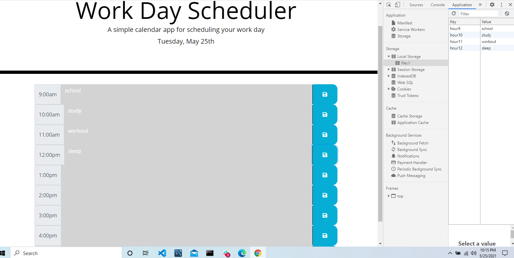

# dayPlanner

## Description

- This app allows the user to create a daily schedule between 9am to 5pm. The user has the ability of adding and saving to the local storage and can also see the current day. The planner has the ability of letting the user what is the current hour.

## Table of Contents

- [Usage](#Usage)
- [Installation](#Installation)

## Usage

- The client will be able to add to each of the time slots on the daily planner
     

- The user will be able to input into each individual time and save it by pressing the time button
   

- When the user clicks the save button it will log it to the console.log and to the local storage

## Installation

1. Downloaded bootstrap and the fontawesome in order to place a container for each of the time slots and add the save buttons to each of the rows
2. Added a container and each individual timesblock into html 
3. added an event listener to the save buttons and placed it as a click event function in order to save it to the local storage and connect it each of the individual timeblocks
4. Changed the color of each of the time blocks by creating a color change function that sets past time as grey and current time and past time
5. created variables for each of the timeblocks in order to set a local storage get item

